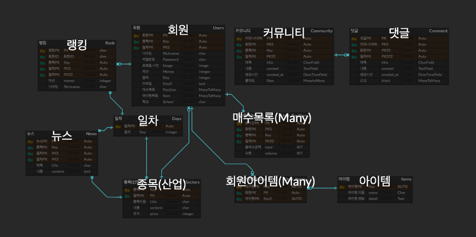
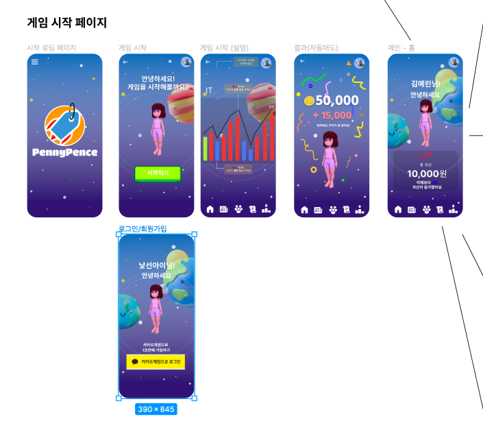
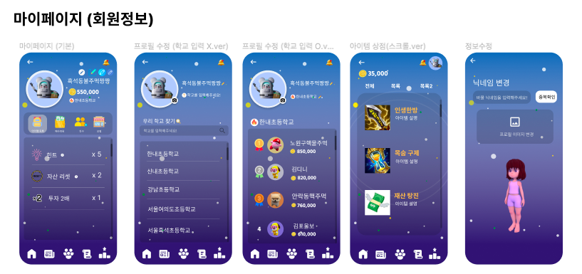
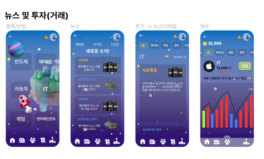
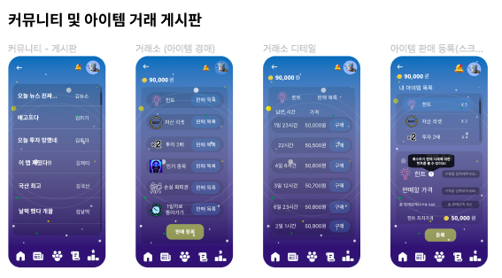
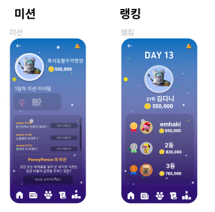

# Penny Pence

초중고 학생을 위한 모의투자 서비스
 
 

## 💰 개발 기간

### 총 개발 기간 23.02.06 ~ 23.02.29

1️⃣ **사전 기획:**  

1️⃣ <b>사전 기획</b> : 02.06 ~ 02.10  

2️⃣ <b>모델 설계</b> : 02.11 ~ 02.13  

3️⃣ <b>디자인 설계</b> : 02.14 ~ 02.17  

4️⃣ <b>메인 서비스 구축</b> : 02.18 ~ 02.28  
 
 

## 🧑🏻‍🎓 팀원

| 이름   | 역할               | 업무                            |
| ------ | ------------------ | ------------------------------- |
| 김예린 | 팀장, 백엔드       | 서버 및 데이터베이스 구축       |
| 이명학 | 백엔드             | 서버 및 데이터베이스 구축, 배포 |
| 최근영 | 프론트엔드         | 화면 페이지 구현                |
| 이용환 | 프론트엔드, 백엔드 | 서버 구축, 화면 페이지 구현     |

 
 
 
 

## 🔨 기술 스택

### Front-End
 

 
 

### Back-End
 

 
 

### ETC
 

 
 

## DB 모델링(ERD)
 

 
 

## 화면
 

### 게임 시작 페이지

 

### 마이페이지

 

### 뉴스 및 투자 페이지 

 

### 커뮤니티 페이지

 

### 미션 및 랭킹 페이지

 

## Github organizations
 

[PennyPence GitHub Kanban](https://github.com/orgs/PennyPence/projects/1)
 